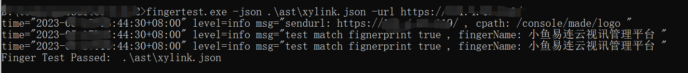

## 指纹项目
郑重声明：文中所涉及的技术、思路和工具仅供以安全为目的的学习交流使用，任何人不得将其用于非法用途以及盈利等目的，否则后果自行承担。
fingerprint是一个基于社区的指纹识别收集仓库。
其中`web_fingerprint`目录下使用以下指纹格式进行编写,`namp_fingerprint`文件下使用nmap官方指纹编写:`https://raw.githubusercontent.com/nmap/nmap/master/nmap-service-probes`
### 指纹实例
```json
{
  "name": "springboot",
  "author": "",
  "version": "",
  "description": "xxx",
  "homepage": "https://github.com/spring-projects/spring-boot",
  "categories": [],
  "path": [],
  "rules": [
    {
      "conditions": [
        {
          "error": true,
          "search": "body",
          "text": "casdadcass"
        }
      ]
    },
    {
      "conditions": [
        {
          "path": "/msmsmsmsmsmmsm2m2mmsmsm",
          "search": "body",
          "regexp": "(Whitelabel Error Page)|(\"error\":\"Not Found\",\"message\":\"No message available\")"
        }
      ]
    }
  ]
}
```

### 注意事项
注意下
1.指纹的文件名称需内容中的name字段一致,可使用中文，但去除空格
2.英文字母或拼音使用小写

应用名案例
```bash
weaver-eoffice
kingdeeeas
smarty
apache-shardingsphere
superwebmailer
apache-apisix
redis
sangfor
```
#### 字段说明
| 字段名称（* 不能为空） | 说明                                     |
|-------------|----------------------------------------|
| name*       | 应用名称                                   |
| author*     | 指纹贡献者                                  |
| version*    | 版本                                     |
| description* | 指纹描述,只描述应用                             |
| homepage*   | 厂商或产品链接                                |
| categories  | 指纹分类，暂未使用                              |
| path*       | 全局路径，该路径对除了包含自定义path的之外的所有condition生效  |
| rules*      | 列表类型，包含多个conditions，每个conditions之间是或关系 |
| conditions* | 包含多个condition，每个condition之间是与关系        |
#### 指纹rule匹配逻辑
匹配逻辑在rules中定义。 rules中包含的多个conditions之间为或关系。 conditions中包含的多个condition为与关系。 condition内部各字段的匹配关系是与关系。

condition内部各字段用途和说明如下:

| 字段名称   | 说明                                                                                                                                                 |
|--------|----------------------------------------------------------------------------------------------------------------------------------------------------|
| path   | str类型，condition自定义的path，该path直接与url拼接，而不是与url+外层path拼接                                                                                             |
| error  | boolen类型，是否仅在错误返回中进行匹配，statuscode非200的均为error状态。<b>注：</b>若未定义改字段，默认只匹配statuscode==200                                                              |
| md5    | 列表类型，对page页面计算md5后进行匹配                                                                                                                             |
| status | int类型，匹配response 状态码                                                                                                                               |
| text   | str类型，定义文本特征，并以字符串方式进行search                                                                                                                       | 
| regexp | str类型，定义正则，并以正则方式进行search                                                                                                                          |
| search | str类型，再返回内容中检索特征，检索的范围包括：<br> title：html title中 <br> body：html body中 <br> headers：response headers中 <br> cookies：response cookie值中 <br> all：以上所有位置 |                                                                           |

### 平台指纹字段说明

| 平台字段   | 说明                                            | 对应指纹json文件字段 |
|--------|-----------------------------------------------|-------------|
| 产品名称   | str类型，产品名称,不包含特殊字符。例如: confluence             | name        |
| 厂商名称   | str类型，产品所属厂商。例如: 上海泛微网络科技股份有限公司                | -           |
| 产品官网   | str类型，产品官方网站完整url。例如: `http://www.baidu.com/` | homepage    |
| 适用版本   | str类型，指纹使用的产品版本,格式:` <1.0&& >1.3 &&1.4 `      | version      |
| 是否开源   | str类型，产品是否可公开下载或再github等平台开源。                 | -           |
| 产品类别   | str类型，选择产品所属类别,由平台提供。                         | categories  |
| 开发语言   | str类型，产品主要开发语言,可多选,例如产品Tomcat选Java。           | -           |
| 产品描述   | str类型，产品简介，可具体说明产品的功能禁止使用夸张的语言描述产品简介。         | description |
| 测试url  | str类型，测试指纹文件的在线网站,多个url已`,`分割。                | -           |
| 产品logo | 文件类型，产品的favicon或可以证明产品的png图片。                 | -           |

### 测试
```bash
fingertest.exe -json xxxx.json -url https://xxxx/
```
测试成功会返回匹配到的fingerName:



### 指纹反馈
当前指纹库收集于互联网，会通过人工验证后入库：
对于未收录的指纹，可通过pr提交,提供测试url、指纹和，
出现指纹误报可以提交issues，可以附上演示URL地址，如果不方便演示可以提交首页的HTML源码，我们会人工修正指纹规则。
